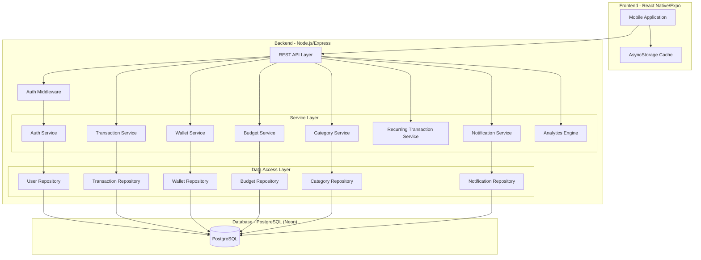
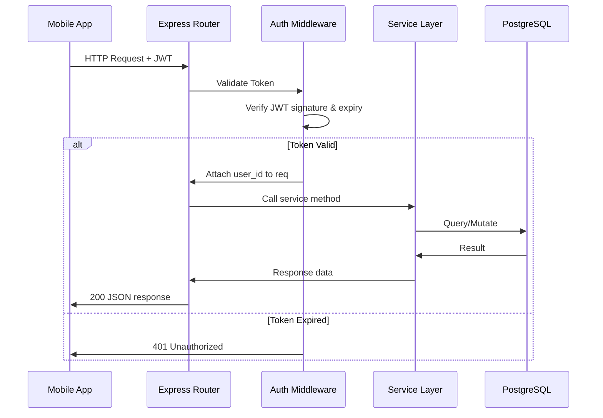
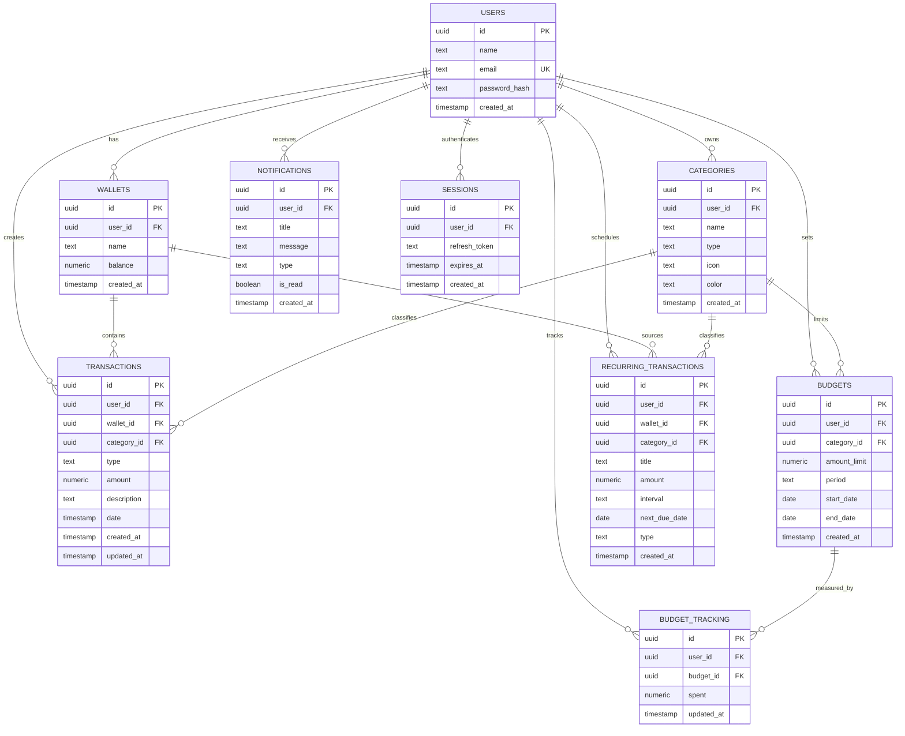

## Design Document: SpendWise Expense Tracker

## Overview

SpendWise is a full-stack expense tracking application built with a Node.js/Express backend (CommonJS), PostgreSQL (Neon) database, and React Native/Expo frontend. The system provides secure user authentication, multi-wallet financial management, transaction tracking, budgeting with alerts, recurring transactions, and financial analytics.

The architecture follows a layered REST API pattern with JWT-based stateless authentication, service-layer business logic, and a relational database model with referential integrity. The system is designed for real-time multi-device usage with future offline-first synchronization capabilities.

### Key Design Decisions

1. **CommonJS modules** — Aligns with the existing `package.json` configuration (`"type": "commonjs"`)
2. **UUID primary keys** — Uses PostgreSQL `pgcrypto` for globally unique, non-sequential identifiers suitable for distributed sync
3. **NUMERIC(12,2) for money** — Avoids floating-point precision issues in financial calculations
4. **JWT with refresh tokens** — Short-lived access tokens (15 min) with longer-lived refresh tokens (7 days) stored in a sessions table for revocability
5. **Service-layer pattern** — Each domain (auth, transactions, wallets, budgets, categories, notifications) encapsulated in a dedicated service module

## Architecture

### System Architecture Diagram



### Request Flow



### Project Structure

```
spendwise/
├── index.js                    # App entry point, Express server setup
├── package.json
├── .env                        # Environment variables
├── MIGRATION/
│   └── 001_initial_schema.sql
├── src/
│   ├── config/
│   │   ├── database.js         # PostgreSQL (Neon) connection pool
│   │   └── jwt.js              # JWT configuration constants
│   ├── middleware/
│   │   ├── auth.js             # JWT verification middleware
│   │   ├── validate.js         # Request validation middleware
│   │   └── errorHandler.js     # Global error handler
│   ├── routes/
│   │   ├── auth.routes.js
│   │   ├── transaction.routes.js
│   │   ├── wallet.routes.js
│   │   ├── budget.routes.js
│   │   ├── category.routes.js
│   │   ├── notification.routes.js
│   │   └── analytics.routes.js
│   ├── services/
│   │   ├── auth.service.js
│   │   ├── transaction.service.js
│   │   ├── wallet.service.js
│   │   ├── budget.service.js
│   │   ├── category.service.js
│   │   ├── notification.service.js
│   │   ├── recurring.service.js
│   │   └── analytics.service.js
│   ├── repositories/
│   │   ├── user.repository.js
│   │   ├── transaction.repository.js
│   │   ├── wallet.repository.js
│   │   ├── budget.repository.js
│   │   ├── category.repository.js
│   │   └── notification.repository.js
│   ├── validators/
│   │   ├── auth.validator.js
│   │   ├── transaction.validator.js
│   │   ├── wallet.validator.js
│   │   ├── budget.validator.js
│   │   └── category.validator.js
│   └── utils/
│       ├── errors.js           # Custom error classes
│       ├── pagination.js       # Pagination helper
│       └── serializer.js       # Transaction serialization/deserialization
└── tests/
    ├── unit/
    ├── integration/
    └── property/
```

## Components and Interfaces

### API Endpoints

#### Authentication (`/api/auth`)

| Method | Endpoint | Description | Auth Required |
|--------|----------|-------------|:---:|
| POST | `/api/auth/register` | Register new user | No |
| POST | `/api/auth/login` | Login with credentials | No |
| POST | `/api/auth/refresh` | Refresh access token | No |
| POST | `/api/auth/logout` | Invalidate session | Yes |

#### Categories (`/api/categories`)

| Method | Endpoint | Description | Auth Required |
|--------|----------|-------------|:---:|
| POST | `/api/categories` | Create category | Yes |
| GET | `/api/categories` | List user categories | Yes |
| PUT | `/api/categories/:id` | Update category | Yes |
| DELETE | `/api/categories/:id` | Delete category | Yes |

#### Transactions (`/api/transactions`)

| Method | Endpoint | Description | Auth Required |
|--------|----------|-------------|:---:|
| POST | `/api/transactions` | Create transaction | Yes |
| GET | `/api/transactions` | List transactions (paginated, filterable) | Yes |
| GET | `/api/transactions/:id` | Get single transaction | Yes |
| PUT | `/api/transactions/:id` | Update transaction | Yes |
| DELETE | `/api/transactions/:id` | Delete transaction | Yes |

#### Wallets (`/api/wallets`)

| Method | Endpoint | Description | Auth Required |
|--------|----------|-------------|:---:|
| POST | `/api/wallets` | Create wallet | Yes |
| GET | `/api/wallets` | List user wallets | Yes |
| PUT | `/api/wallets/:id` | Update wallet name | Yes |
| DELETE | `/api/wallets/:id` | Delete wallet | Yes |
| POST | `/api/wallets/transfer` | Transfer between wallets | Yes |

#### Budgets (`/api/budgets`)

| Method | Endpoint | Description | Auth Required |
|--------|----------|-------------|:---:|
| POST | `/api/budgets` | Create budget | Yes |
| GET | `/api/budgets` | List user budgets with progress | Yes |
| PUT | `/api/budgets/:id` | Update budget limit | Yes |
| DELETE | `/api/budgets/:id` | Delete budget | Yes |

#### Notifications (`/api/notifications`)

| Method | Endpoint | Description | Auth Required |
|--------|----------|-------------|:---:|
| GET | `/api/notifications` | List user notifications | Yes |
| PUT | `/api/notifications/:id/read` | Mark notification as read | Yes |

#### Analytics (`/api/analytics`)

| Method | Endpoint | Description | Auth Required |
|--------|----------|-------------|:---:|
| GET | `/api/analytics/monthly-summary` | Monthly income/expense/net | Yes |
| GET | `/api/analytics/category-breakdown` | Spending per category | Yes |
| GET | `/api/analytics/trends` | 6-month expense trends | Yes |

### Service Interfaces

```javascript
// Auth Service
module.exports = {
  register(name, email, password),        // Returns { accessToken, refreshToken, user }
  login(email, password),                  // Returns { accessToken, refreshToken, user }
  refreshToken(refreshToken),              // Returns { accessToken, refreshToken }
  logout(refreshToken),                    // Returns void
  verifyAccessToken(token),                // Returns { userId }
};

// Transaction Service
module.exports = {
  create(userId, { amount, type, categoryId, description, date, walletId }),
  getById(userId, transactionId),
  list(userId, { page, limit, startDate, endDate, categoryId, type, search }),
  update(userId, transactionId, updates),
  delete(userId, transactionId),
  serialize(transaction),                  // Transaction → JSON string
  deserialize(jsonString),                 // JSON string → validated Transaction
};

// Wallet Service
module.exports = {
  create(userId, { name, balance }),
  list(userId),
  update(userId, walletId, { name }),
  delete(userId, walletId),
  transfer(userId, { sourceWalletId, destinationWalletId, amount }),
  adjustBalance(walletId, amount, type),   // Internal: adjust balance on transaction
};

// Budget Service
module.exports = {
  create(userId, { categoryId, amountLimit, period, startDate }),
  list(userId),
  update(userId, budgetId, { amountLimit }),
  delete(userId, budgetId),
  updateSpent(userId, categoryId, amount, operation), // 'add' or 'subtract'
  recalculateSpent(userId, categoryId),
  getProgress(budgetId),                   // Returns { spent, limit, percentage }
};

// Category Service
module.exports = {
  create(userId, { name, type, icon, color }),
  list(userId),
  update(userId, categoryId, { name, icon, color }),
  delete(userId, categoryId),
};

// Notification Service
module.exports = {
  create(userId, { title, message, type }),
  list(userId),
  markAsRead(userId, notificationId),
  checkBudgetThresholds(userId, budgetId), // Creates notifications at 50%, 75%, 100%
};

// Analytics Engine
module.exports = {
  getMonthlySummary(userId, year, month),
  getCategoryBreakdown(userId, startDate, endDate),
  getSpendingTrends(userId),              // Last 6 months
};
```

### Middleware

```javascript
// Auth Middleware
function authenticate(req, res, next) {
  // Extracts JWT from Authorization: Bearer <token>
  // Verifies signature and expiration
  // Attaches req.userId on success
  // Returns 401 on failure
}

// Validation Middleware Factory
function validate(schema) {
  // Returns middleware that validates req.body against schema
  // Returns 400 with field-level errors on failure
}
```

## Data Models

### Entity Relationship Diagram



### Application-Level Models (JavaScript)

```javascript
// Transaction model (used in serialization/deserialization)
const Transaction = {
  id: 'uuid',
  userId: 'uuid',
  walletId: 'uuid',
  categoryId: 'uuid',
  type: 'income' | 'expense',
  amount: 'string (numeric)',  // Stored as string to preserve precision
  description: 'string | null',
  date: 'ISO 8601 string',
  createdAt: 'ISO 8601 string',
  updatedAt: 'ISO 8601 string',
};

// Budget progress model (computed)
const BudgetProgress = {
  budgetId: 'uuid',
  categoryId: 'uuid',
  categoryName: 'string',
  amountLimit: 'string (numeric)',
  spent: 'string (numeric)',
  remaining: 'string (numeric)',
  percentage: 'number (0-100+)',
  period: 'weekly' | 'monthly',
  startDate: 'ISO 8601 date string',
  endDate: 'ISO 8601 date string | null',
};

// Wallet transfer model
const WalletTransfer = {
  sourceWalletId: 'uuid',
  destinationWalletId: 'uuid',
  amount: 'string (numeric)',
};

// Analytics summary model
const MonthlySummary = {
  year: 'number',
  month: 'number',
  totalIncome: 'string (numeric)',
  totalExpenses: 'string (numeric)',
  netBalance: 'string (numeric)',
};
```

### Database Interaction Patterns

- **Connection pooling**: Use `pg` pool with Neon's serverless driver for connection management
- **Transactions**: Use PostgreSQL `BEGIN/COMMIT/ROLLBACK` for multi-table operations (e.g., creating a transaction + updating wallet balance + updating budget tracking)
- **Parameterized queries**: All queries use parameterized inputs ($1, $2, ...) to prevent SQL injection
- **Pagination**: Offset-based pagination with `LIMIT` and `OFFSET` clauses, default page size of 20

## UI/UX Design Theme

### Color Palette

| Token | Hex | Usage |
|-------|-----|-------|
| Primary | `#0D9488` (Deep Teal) | Trust, stability, financial security — primary actions, navigation accents |
| Secondary/Accent | `#F59E0B` (Warm Gold) | Attention to key actions — CTAs, highlights, important indicators |
| Background | `#F8FAFC` (Off-white) | Page background with white (`#FFFFFF`) cards |
| Dark Mode Background | `#0F172A` (Deep Navy) | Dark mode page background |
| Success/Income | `#10B981` (Emerald Green) | Income transactions, positive balances, success states |
| Expense/Warning | `#EF4444` (Soft Coral) | Expense transactions, budget overages, destructive actions |
| Text Primary | `#1E293B` (Slate Gray) | Headings, body text, high-contrast content |
| Text Secondary | `#64748B` (Slate Gray Light) | Captions, labels, secondary information |

### Typography

- **Font Family**: Inter or SF Pro — clean, modern readability optimized for financial data
- **Scale**: Use a modular type scale (e.g., 12px / 14px / 16px / 20px / 24px / 32px)
- **Weight**: 400 (body), 500 (labels), 600 (headings), 700 (large headings/amounts)

### Shape & Elevation

- **Border Radius**: 12px for cards and modals, 8px for buttons and inputs — modern rounded aesthetic
- **Shadows**: Soft elevation using colored shadows that reference the primary palette:
  - Card: `0 4px 12px rgba(13, 148, 136, 0.08)`
  - Elevated card (hover): `0 8px 24px rgba(13, 148, 136, 0.12)`
  - Button: `0 2px 8px rgba(13, 148, 136, 0.15)`
- **Spacing**: 4px base unit, consistent 8/12/16/24/32px spacing scale

### Design Principles

1. **Calm financial interface** — avoid dense layouts; use generous whitespace to reduce cognitive load
2. **Scannable data** — align amounts to the right, use color-coding for income (green) vs expense (red)
3. **Progressive disclosure** — show summary first, let users drill into details on demand
4. **Accessible contrast** — all text meets WCAG AA 4.5:1 contrast ratio minimum
5. **Consistent feedback** — use teal for confirmations, gold for warnings, coral for errors/expenses

## Correctness Properties

*A property is a characteristic or behavior that should hold true across all valid executions of a system — essentially, a formal statement about what the system should do. Properties serve as the bridge between human-readable specifications and machine-verifiable correctness guarantees.*

### Property 1: Transaction Serialization Round-Trip

*For any* valid Transaction object, serializing it to JSON and then deserializing the resulting JSON string back SHALL produce a Transaction object equivalent to the original.

**Validates: Requirements 18.1, 18.2, 18.3**

### Property 2: Malformed JSON Returns Descriptive Parse Error

*For any* syntactically invalid JSON string, the Transaction_Service deserialization SHALL return a descriptive parse error indicating the location of the syntax issue, without throwing an unhandled exception.

**Validates: Requirements 18.4**

### Property 3: Wallet Balance Adjustment Invariant

*For any* transaction of a given amount and type, creating the transaction SHALL adjust the associated wallet balance by exactly that amount (decrease for expense, increase for income), and deleting or reversing the transaction SHALL restore the balance to its prior value. Updating a transaction's amount or type SHALL adjust the wallet balance by the net difference.

**Validates: Requirements 4.2, 4.3, 5.2, 6.1, 6.2**

### Property 4: Wallet Transfer Conservation

*For any* valid transfer of amount A between a source wallet and destination wallet, the source balance SHALL decrease by A, the destination balance SHALL increase by A, and the total sum of all wallet balances SHALL remain unchanged.

**Validates: Requirements 11.1**

### Property 5: Budget Tracking Adjustment Invariant

*For any* expense transaction with an active budget for its category, creating the transaction SHALL increase budget_tracking spent by the transaction amount, deleting it SHALL decrease spent by the same amount, and changing its category SHALL decrease the old category's spent and increase the new category's spent by the transaction amount.

**Validates: Requirements 4.6, 5.4, 6.4**

### Property 6: Budget Progress Calculation

*For any* budget with amount_limit L and budget_tracking spent S (where L > 0), the budget progress percentage SHALL equal (S / L) × 100.

**Validates: Requirements 8.5**

### Property 7: Budget Threshold Notifications

*For any* budget, when the budget_tracking spent crosses the 50%, 75%, or 100% threshold of the amount_limit, the Notification_Service SHALL create exactly one notification of the corresponding type (warning, caution, critical) for that threshold.

**Validates: Requirements 9.1, 9.2, 9.3**

### Property 8: Threshold Notification Idempotence

*For any* budget and threshold level, the Notification_Service SHALL generate at most one notification per threshold per budget per period, regardless of how many times the spent amount crosses that threshold.

**Validates: Requirements 9.4**

### Property 9: User Data Isolation

*For any* two distinct users A and B, user A SHALL never be able to read, update, or delete transactions, wallets, budgets, categories, or analytics data belonging to user B. Attempts to access another user's resources SHALL be rejected with an authorization error.

**Validates: Requirements 5.3, 6.3, 7.6, 13.4**

### Property 10: Transaction Filter Correctness

*For any* applied filter (date range, category, type, or search term), every transaction in the result set SHALL satisfy ALL active filter criteria, and no transaction that satisfies all criteria SHALL be excluded from the result.

**Validates: Requirements 7.2, 7.3, 7.4, 7.5**

### Property 11: Transaction List Ordering

*For any* paginated transaction list response, transactions SHALL be sorted by date in strictly descending order within and across pages.

**Validates: Requirements 7.1**

### Property 12: Invalid Transfer Rejection

*For any* transfer where the amount exceeds the source wallet balance, OR the amount is ≤ 0, OR the source and destination wallets are the same, the Wallet_Service SHALL reject the transfer without modifying any wallet balance.

**Validates: Requirements 11.2, 11.3, 11.4**

### Property 13: Password Hashing

*For any* user password, the Auth_Service SHALL store it as a bcrypt hash with cost factor ≥ 10, and the stored hash SHALL never equal the plaintext password.

**Validates: Requirements 1.5, 17.2**

### Property 14: Enum Field Validation

*For any* string value that is not in the allowed set for a given enum field (category type: "income"/"expense", budget period: "weekly"/"monthly"), the respective service SHALL reject the request with a validation error.

**Validates: Requirements 3.6, 8.6**

### Property 15: Wallet Non-Negative Balance Constraint

*For any* expense transaction or transfer that would cause a wallet balance to become negative, the system SHALL reject the operation without modifying the balance.

**Validates: Requirements 10.5, 11.2**

### Property 16: Analytics Aggregation Correctness

*For any* user and time period, the monthly summary total_income SHALL equal the sum of all income transaction amounts in that period, total_expenses SHALL equal the sum of all expense transaction amounts, and net_balance SHALL equal total_income minus total_expenses.

**Validates: Requirements 13.1, 13.2**

### Property 17: Duplicate Detection

*For any* entity where uniqueness is required (email for users, name+type for categories under the same user, category+period for active budgets), attempting to create a duplicate SHALL be rejected without creating any record or modifying existing data.

**Validates: Requirements 1.2, 3.2, 8.2**

## Error Handling

### Error Response Format

All API errors follow a consistent JSON structure:

```json
{
  "success": false,
  "error": {
    "code": "VALIDATION_ERROR",
    "message": "Human-readable error description",
    "details": [
      { "field": "amount", "message": "Amount must be greater than zero" }
    ]
  }
}
```

### Error Categories

| HTTP Status | Error Code | Description |
|:-----------:|:-----------|:------------|
| 400 | `VALIDATION_ERROR` | Invalid input data (missing fields, wrong types, constraint violations) |
| 400 | `DUPLICATE_ERROR` | Unique constraint violation (duplicate email, category name, budget) |
| 400 | `INSUFFICIENT_FUNDS` | Transfer or expense would make wallet balance negative |
| 400 | `INVALID_TRANSFER` | Self-transfer or zero/negative transfer amount |
| 400 | `PARSE_ERROR` | Malformed JSON body with syntax error location |
| 401 | `AUTHENTICATION_ERROR` | Invalid or expired JWT access token |
| 401 | `REFRESH_TOKEN_EXPIRED` | Refresh token is expired or invalid |
| 403 | `AUTHORIZATION_ERROR` | User attempting to access another user's resource |
| 404 | `NOT_FOUND` | Resource does not exist |
| 409 | `CONFLICT` | Resource state conflict (e.g., deleting wallet with transactions) |
| 500 | `INTERNAL_ERROR` | Unexpected server error (logged, generic message to client) |

### Error Handling Strategy

1. **Validation layer** — Express middleware validates request body against schemas (using Joi or express-validator) before reaching service logic. Returns 400 with field-level details.

2. **Service layer** — Business logic throws custom error classes (`ValidationError`, `AuthorizationError`, `ConflictError`, etc.) that carry the error code and HTTP status.

3. **Repository layer** — Database errors are caught and translated:
   - Unique constraint violations → `DuplicateError`
   - Foreign key violations → `ValidationError` with "referenced resource not found"
   - Connection errors → `InternalError` (logged with details, generic message to client)

4. **Global error handler** — A centralized Express error-handling middleware catches all thrown errors, maps them to the response format, and logs unexpected errors:

```javascript
function errorHandler(err, req, res, next) {
  if (err instanceof AppError) {
    return res.status(err.statusCode).json({
      success: false,
      error: { code: err.code, message: err.message, details: err.details }
    });
  }
  // Unexpected error — log full stack, return generic message
  logger.error(err);
  return res.status(500).json({
    success: false,
    error: { code: 'INTERNAL_ERROR', message: 'An unexpected error occurred' }
  });
}
```

5. **Database transaction rollback** — Multi-step operations (transaction creation + wallet balance + budget tracking) use PostgreSQL transactions. If any step fails, the entire operation is rolled back to maintain data consistency.

6. **Authentication errors** — The auth middleware returns generic error messages ("Invalid credentials") without revealing whether the email or password was incorrect, preventing user enumeration.

7. **Rate limiting** (future) — Apply rate limits to auth endpoints to mitigate brute-force attacks.

## Testing Strategy

### Testing Approach

The SpendWise backend uses a dual testing approach combining **unit tests** for specific examples and edge cases with **property-based tests** for universal correctness guarantees across all inputs.

### Test Framework Stack

- **Test Runner**: Jest (CommonJS compatible, widely used in Node.js ecosystem)
- **Property-Based Testing**: fast-check (JavaScript PBT library with Jest integration)
- **HTTP Testing**: supertest (for integration tests against Express routes)
- **Database**: Test-specific PostgreSQL database or pg-mem for in-memory testing

### Test Categories

#### 1. Property-Based Tests (`tests/property/`)

Each property test corresponds to a correctness property from the design document. Tests run a minimum of **100 iterations** with randomly generated inputs.

| Test File | Properties Covered |
|-----------|-------------------|
| `serialization.property.test.js` | Property 1 (round-trip), Property 2 (malformed JSON) |
| `wallet-balance.property.test.js` | Property 3 (balance adjustment), Property 4 (transfer conservation), Property 15 (non-negative) |
| `budget-tracking.property.test.js` | Property 5 (tracking adjustment), Property 6 (progress calc), Property 7 (thresholds), Property 8 (idempotence) |
| `authorization.property.test.js` | Property 9 (user isolation) |
| `transaction-query.property.test.js` | Property 10 (filter correctness), Property 11 (ordering) |
| `validation.property.test.js` | Property 12 (invalid transfers), Property 14 (enum validation), Property 17 (duplicates) |
| `auth.property.test.js` | Property 13 (password hashing) |
| `analytics.property.test.js` | Property 16 (aggregation correctness) |

Each test is tagged with a comment referencing its design property:
```javascript
// Feature: spendwise-expense-tracker, Property 1: Transaction Serialization Round-Trip
test.prop('serialize then deserialize produces equivalent transaction', [transactionArb], (txn) => {
  const result = deserialize(serialize(txn));
  expect(result).toEqual(txn);
});
```

**Configuration**: All property tests use `{ numRuns: 100 }` minimum.

#### 2. Unit Tests (`tests/unit/`)

Focus on specific examples, edge cases, and error conditions not covered by property generators:

- **Auth service**: Token expiry timing (15 min / 7 days), session creation on register, logout invalidation
- **Transaction service**: `updated_at` set on creation, specific field validation messages
- **Budget service**: Progress percentage at boundary values (0%, 50%, 75%, 100%)
- **Wallet service**: Deletion rejection reasons (has transactions vs. non-zero balance)
- **Category service**: Reassignment to "Uncategorized" on delete
- **Analytics engine**: Zero values for empty periods

#### 3. Integration Tests (`tests/integration/`)

Test full request/response cycles through the Express application:

- **Auth flow**: Register → Login → Refresh → Logout
- **Transaction CRUD**: Create → Read → Update → Delete with wallet balance verification
- **Budget alerts**: Create budget → Add expenses → Verify notifications at thresholds
- **Wallet transfers**: Successful transfer → Verify linked transactions created
- **Pagination**: Verify page size, offset behavior, total count headers
- **Error responses**: Verify error format consistency across all endpoints

#### 4. Performance Tests (separate, not in CI)

- Load testing with k6 or Artillery for Requirements 16.1-16.4
- Pagination performance with large datasets (500+ records)

### Test Execution

```bash
# Run all tests
npm test

# Run property tests only
npm run test:property

# Run unit tests only
npm run test:unit

# Run integration tests only
npm run test:integration
```

### Custom Generators (fast-check arbitraries)

```javascript
// Transaction arbitrary — generates valid Transaction objects
const transactionArb = fc.record({
  id: fc.uuid(),
  userId: fc.uuid(),
  walletId: fc.uuid(),
  categoryId: fc.uuid(),
  type: fc.constantFrom('income', 'expense'),
  amount: fc.float({ min: 0.01, max: 999999.99 }).map(v => v.toFixed(2)),
  description: fc.option(fc.string({ minLength: 0, maxLength: 255 })),
  date: fc.date({ min: new Date('2020-01-01'), max: new Date('2030-12-31') }).map(d => d.toISOString()),
  createdAt: fc.date().map(d => d.toISOString()),
  updatedAt: fc.date().map(d => d.toISOString()),
});

// Wallet arbitrary — generates wallets with realistic balances
const walletArb = fc.record({
  id: fc.uuid(),
  userId: fc.uuid(),
  name: fc.string({ minLength: 1, maxLength: 50 }),
  balance: fc.float({ min: 0, max: 1000000 }).map(v => v.toFixed(2)),
});

// Invalid email arbitrary — strings that should NOT pass email validation
const invalidEmailArb = fc.oneof(
  fc.string().filter(s => !s.includes('@')),
  fc.string().map(s => s + '@@'),
  fc.constant(''),
  fc.string().map(s => '@' + s),
);
```

### Test Data Management

- Integration tests use a dedicated test database cleaned between test suites
- Property tests operate on in-memory data structures (service-layer logic) or use mocked repositories
- No tests depend on external services or network connectivity

